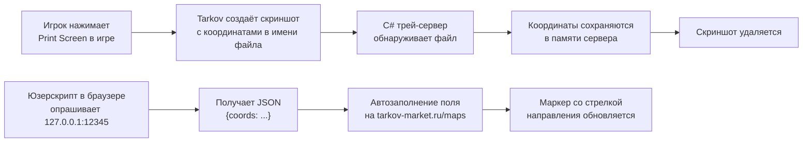

# Tarkov Map Tracker

> Автоматическое отслеживание позиции игрока на картах **Escape from Tarkov** без сворачивания игры и потери фокуса c добавлением кастомной стрелки на онлайн карту.

[](https://github.com/Onzis/TarkovMapTracker/raw/refs/heads/main/TarkovMapTrackerAuto.user.js)
[](https://github.com/Onzis/TarkovMapTracker/stargazers) 
[](LICENSE)


---

## О проекте

**Tarkov Map Tracker** — это связка из двух компонентов, которая позволяет в реальном времени видеть своё местоположение на онлайн-карте `tarkov-market.ru/maps`, не выходя из игры. Решение построено на простой идее: Escape from Tarkov при создании скриншота записывает в имя файла текущие координаты персонажа и угол поворота. Проект перехватывает эти скриншоты, извлекает координаты и через локальный HTTP-сервер передаёт их в браузерный юзерскрипт, который автоматически подставляет значения в поле ввода карты.

Главное преимущество — **полное отсутствие Alt-Tab**. Игрок просто нажимает клавишу скриншота прямо в рейде, и через секунду маркер на карте в соседнем окне обновляется сам. Это особенно удобно при стримах, игре в отряде или прохождении сложных карт, где постоянно нужно сверяться с маршрутом.

Проект не вмешивается в процесс игры, не читает её память и не модифицирует файлы Tarkov — он работает исключительно с папкой скриншотов, которую игра создаёт сама по стандартному пути в Документах.

---

## Как это работает



| Этап | Что происходит |
|------|----------------|
| 1. Скриншот в игре | Tarkov сохраняет PNG в `Documents\Escape from Tarkov\Screenshots\` с именем вида `1920, 1080, 100, 45` (координаты + угол) |
| 2. Перехват файла | `FileSystemWatcher` в C#-сервере ловит создание `.png`/`.jpg`/`.jpeg` |
| 3. Извлечение координат | Имя файла без расширения сохраняется как `latestCoords`, а сам файл удаляется |
| 4. HTTP-выдача | Локальный сервер на `127.0.0.1:12345` отдаёт JSON `{"coords":"..."}` по запросу и обнуляет значение |
| 5. Опрос браузером | Юзерскрипт раз в секунду делает `GM_xmlhttpRequest` к локальному серверу |
| 6. Автоввод | Скрипт находит `input` на карте, подставляет координаты и эмулирует нажатие Enter |
| 7. Отрисовка стрелки | На стандартный маркер сайта накладывается SVG-стрелка направления |

---

## Возможности

- **Полностью автоматический ввод координат** — ручное копирование и вставка больше не нужны.
- **Без потери фокуса игры** — взаимодействие идёт через локальный HTTP-сервер, игра не сворачивается.
- **Стрелка направления** — на маркере сайта отображается SVG-стрелка, показывающая, куда смотрит персонаж.
- **Тихий режим в трее** — сервер живёт в системном трее Windows с контекстным меню.
- **Автозагрузка** — опция запуска при старте системы, переключается из контекстного меню трея.
- **Автоочистка скриншотов** — после извлечения координат файлы скриншотов удаляются, папка не засоряется.
- **CORS-заголовки** — сервер отдаёт правильные `Access-Control-*`, что позволяет юзерскрипту обращаться к нему без ограничений браузера.
- **Журналирование ошибок** — при сбое рядом с `.exe` создаётся `error_YYYYMMDD_HHMMSS.txt` с детальным дампом исключения.
- **Обновление юзерскрипта** — поддержка `@updateURL` / `@downloadURL` для автоапдейта через Tampermonkey.

---

## Требования

### Серверная часть (Windows)
- **ОС:** Windows 7+ (рекомендуется Windows 10/11)
- **.NET Framework 4.x** (предустановлен в современных версиях Windows)
- **Папка скриншотов Tarkov:** `Documents\Escape from Tarkov\Screenshots\` (создаётся игрой автоматически)
- **Свободный порт:** `12345` на `127.0.0.1`

### Юзерскрипт (браузер)
- **Браузер:** Chrome, Firefox, Edge или любой совместимый
- **Менеджер скриптов:** [Tampermonkey](https://www.tampermonkey.net/) или [Violentmonkey](https://violentmonkey.github.io/)
- **Сайт карты:** [tarkov-market.ru/maps](https://tarkov-market.ru/maps)

### В игре
- Включённые скриншоты с записью координат в имя файла (стандартное поведение Tarkov при создании скриншота клавишей Print Screen).

---

## Установка

### 1. Серверная часть (C# / .exe)

**Вариант A — использовать готовый билд (проще всего):**

1. Скачайте [`TarkovMapTracker.exe`](TarkovMapTracker.exe) из корня репозитория.
2. Поместите `.exe` в любую удобную папку, например `C:\Tools\TarkovMapTracker\`.
3. Запустите `TarkovMapTracker.exe`.
4. В системном трее появится иконка приложения, а всплывающее уведомление подтвердит запуск сервера на `http://127.0.0.1:12345`.

**Вариант B — собрать из исходников:**

```bash
# Требуется .NET Framework SDK или Visual Studio с поддержкой WinForms
csc TarkovMapTracker.cs /target:winexe /r:System.Windows.Forms.dll /r:System.Drawing.dll /resource:public/ico/pngegg.png,TarkovMapTracker.pngegg.png
```

После сборки вы получите `TarkovMapTracker.exe`, который можно запускать напрямую.

### 2. Юзерскрипт (Tampermonkey)

1. Установите расширение **Tampermonkey** в браузер.
2. Откройте дашборд Tampermonkey → вкладка **Utilities** → **Import from URL**.
3. Вставьте ссылку:
   ```
   https://github.com/Onzis/TarkovMapTracker/raw/refs/heads/main/TarkovMapTrackerAuto.user.js
   ```
4. Подтвердите установку скрипта.
5. Откройте любую карту на [tarkov-market.ru/maps](https://tarkov-market.ru/maps) — скрипт активируется автоматически.

Альтернативно можно вручную скопировать содержимое [`TarkovMapTrackerAuto.user.js`](TarkovMapTrackerAuto.user.js) и создать новый скрипт в Tampermonkey.

---

## Использование

1. Убедитесь, что `TarkovMapTracker.exe` запущен (иконка в трее активна).
2. В браузере откройте нужную карту на `tarkov-market.ru/maps`.
3. Запустите Escape from Tarkov и зайдите в рейд.
4. В любой момент нажмите **Print Screen** (или вашу клавишу скриншота).
5. В течение ~1 секунды маркер на карте обновится, отобразив ваше местоположение и направление взгляда.
6. Повторяйте по необходимости — каждый новый скриншот обновляет маркер.

> Совет: выведите окно браузера с картой на второй монитор или в режиме Picture-in-Picture, чтобы видеть позицию, не отвлекаясь от игры.

---

## Настройка

### Включение скриншотов с координатами в Tarkov

По умолчанию Escape from Tarkov записывает координаты в имя файла скриншота. Если имена файлов выглядят как обычные таймстампы — проверьте настройки игры:

1. В настройках Tarkov убедитесь, что скриншоты включены.
2. Папка назначения должна быть стандартной: `Documents\Escape from Tarkov\Screenshots\`.
3. Формат имени файла, который понимает сервер: `X, Y, heading` — обычно три числа через запятую.

### Поворот стрелки направления

Если стрелка на маркере смотрит не туда, куда смотрит персонаж, откалибруйте угол «Севера» прямо в юзерскрипте:

```javascript
// TarkovMapTrackerAuto.user.js
const ARROW_CORRECTION_ANGLE = 0; // ← поставьте 90, 180 или -90
```

Допустимые значения: `0`, `90`, `180`, `-90`. После изменения сохраните скрипт в Tampermonkey и перезагрузите страницу карты.

### Автозагрузка сервера

1. Кликните правой кнопкой по иконке **Tarkov Map Tracker** в трее.
2. Выберите пункт **«Автозагрузка»**.
3. Галочка означает, что сервер будет запускаться вместе с Windows. Повторный клик убирает приложение из автозагрузки.

В реестре используется ключ `HKCU\Software\Microsoft\Windows\CurrentVersion\Run\TarkovMapTracker`.

---

## Устранение неисправностей

| Симптом | Причина | Решение |
|---------|---------|---------|
| Маркер на карте не обновляется | Сервер не запущен | Проверьте иконку в трее, при необходимости перезапустите `TarkovMapTracker.exe` |
| В трее предупреждение «Папка не найдена» | Tarkov ни разу не делал скриншотов | Сделайте первый скриншот в игре, чтобы создалась папка `Screenshots` |
| Юзерскрипт не получает данные | Порт 12345 занят другим приложением | Освободите порт или измените его в `TarkovMapTracker.cs` и в `@connect` юзерскрипта |
| Стрелка смотрит не в ту сторону | Несовпадение нуля карты | Скорректируйте `ARROW_CORRECTION_ANGLE` в юзерскрипте |
| Юзерскрипт не активен | Tampermonkey не включён | Включите скрипт в дашборде Tampermonkey, иконка должна быть зелёной |
| Скриншоты не удаляются | Нет прав на запись в папку | Запустите `.exe` от имени администратора или проверьте права на `Documents\Escape from Tarkov\Screenshots\` |
| Сервер упал с ошибкой | Необработанное исключение | Откройте `error_*.txt` рядом с `.exe` и приложите к issue |

### Где смотреть логи

Сервер не ведёт постоянный лог, но при любом необработанном исключении рядом с `.exe` создаётся дамп:

```
error_20250115_143022.txt
```

Внутри — время, версия ОС, тип исключения, сообщение и полный стек-трейс включая внутренние исключения.

---

### Архитектура решений

- **Почему `FileSystemWatcher`, а не чтение памяти игры?** Это безопаснее с точки зрения античита и не нарушает EULA Tarkov. Сервер работает исключительно с публичными файлами в Документах.
- **Почему локальный HTTP-сервер, а не WebExtension native messaging?** Проще в установке — не нужно регистрировать native host manifest в системе. Достаточно одного `.exe`.
- **Почему CORS разрешён для всех origin (`*`)?** Сервер слушает только loopback-интерфейс `127.0.0.1`, поэтому безопасность не страдает, а юзерскрипт может обращаться без ограничений.
- **Почему координаты обнуляются после выдачи?** Чтобы один и тот же скриншот не применялся дважды — следующий poll получит пустую строку и не будет перезаписывать маркер.

---

## Безопасность и отказ от ответственности

- Проект **не взаимодействует** с процессом Escape from Tarkov, не читает её память и не модифицирует игровые файлы.
- Сервер слушает только `127.0.0.1` — он недоступен извне и не открывает порты в локальную сеть.
- Использование скриншотов с координатами — штатная механика Tarkov, не нарушающая правила игры.
- Проект распространяется «как есть» под лицензией GPL-3.0. Автор не несёт ответственности за любые последствия использования.

---

## Совместимость с картами

Юзерскрипт написан под структуру DOM сайта **tarkov-market.ru/maps**:

- Ищет `input[placeholder*="Вставьте сюда имя файла"]` для подстановки координат.
- Добавляет SVG-стрелку в `div.marker` для отображения направления.

Если сайт изменит вёрстку, селекторы в скрипте могут потребовать обновления. Откройте issue с описанием проблемы — автор постарается адаптировать скрипт.

---

## Участие в разработке

PR и issue приветствуются. Перед крупными изменениями, пожалуйста, откройте обсуждение, чтобы согласовать подход.

## Лицензия

Проект распространяется под лицензией **GNU General Public License v3.0**. См. файл [LICENSE](LICENSE) для подробностей.

---

## Автор

**Onzis** — [github.com/Onzis](https://github.com/Onzis)

Если проект оказался полезным — поставьте ★ репозиторию, это поможет другим игрокам Tarkov найти его.
